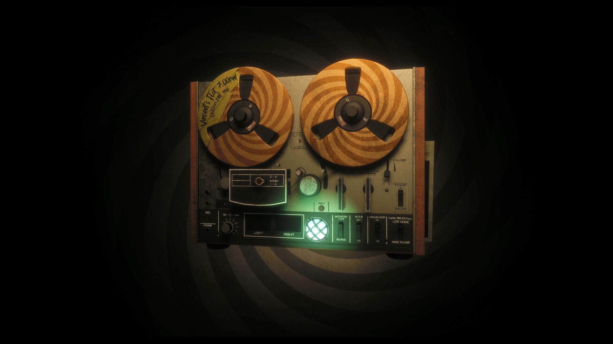

<!--
  This file is generated from site-spec.yaml.
  Do not edit directly.
  Run npm run site:generate instead.
  Source: site-input/pages/weapons-guide.md
-->
Every weapon in Twisted Tower is "amusement-park toy" themed. The arsenal below is what the official store page confirms; weapons are **found while exploring** the tower and upgraded with Tickets earned in combat.

## The officially announced arsenal

Here is the toy arsenal listed on the official Steam store page (officially described as "and more" — the list is not exhaustive):

| Weapon | Notes (based on official names and review descriptions) |
| --- | --- |
| Whack-a-Mole mallet | Starting melee weapon; costs no ammo and saves bullets early on |
| Rubber-Band Pistol | Early ranged weapon, accurate |
| Dart-Throwin' Tommy Gun | Fast fire rate, good for groups of enemies |
| Fartin' Shotgun | High close-range burst, great in tight spaces |
| Bubblegum-Spittin' Chain-Gun | High fire rate suppression |
| Sniper Slingshot | Accurate long-range weapon |
| Skull-Poppin' Ray Gun | Later energy weapon |

> **Evidence boundary**: the official store page does not map which weapon is found on which floor, and does not give a total weapon count. Third-party guides contradict each other on weapon locations, so this page deliberately omits floor-by-floor pickups and any "best weapon" ranking.

## Upgrades: Tickets and upgrade stations

- **Tickets are the upgrade currency**: earned from kills and found in levels (sources: official achievements "Tickets, Tickets, Tickets!" and "Ticket Titan").
- Upgrade machines / stations in the world sell upgrades for weapons and gear (sources: COGconnected and NoobFeed reviews).
- **Alternate fires are upgradable**: the official "Alt Fire Fiend" achievement requires upgrading every available alternate fire. Reviews note different alternate fires per weapon, such as an explosive shot for the shotgun and a slow-motion magazine dump for the Tommy Gun.
- **Weapons can be maxed out**: the official "Weapon Wizard" achievement requires maxing every weapon, and "Ticket Titan" requires hoarding 2,000 Tickets.

## How to spend Tickets (advice, not official mechanics)

The following are guide suggestions rather than official mechanics:

- **Fix the fight you're actually losing**: if you always run dry on ammo, prioritize magazine size or a weapon with sustained fire; if you keep getting rushed, consider melee or close-range options.
- **Don't pour everything into one gun**: reviews and community runs agree different distances and encounters need different weapons; keeping two ammo pools (close-range burst + precise range) is steadier than maxing one gun.
- **Read the upgrade card before buying**: upgrade stations show the weapon name, the upgrade (damage / magazine / alternate fire), and the Ticket price — confirm it's the item you're using and actually need.
- **Verify after buying**: return to the arsenal to confirm the upgrade applied before moving on.

(Sources: community completion runs and published launch reviews; see the [editorial method](/twisted-tower/editorial-method/).)
