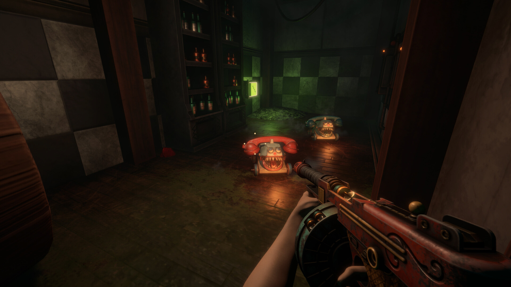
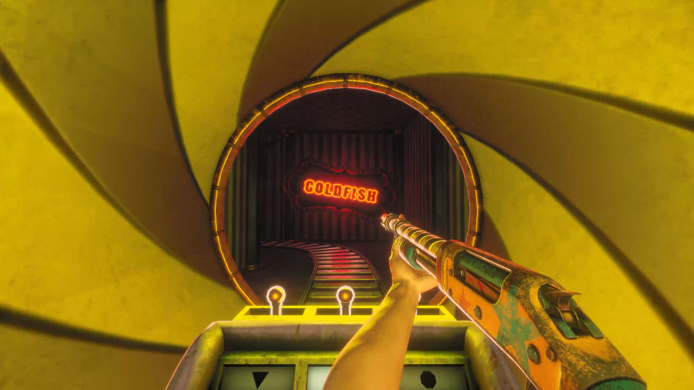
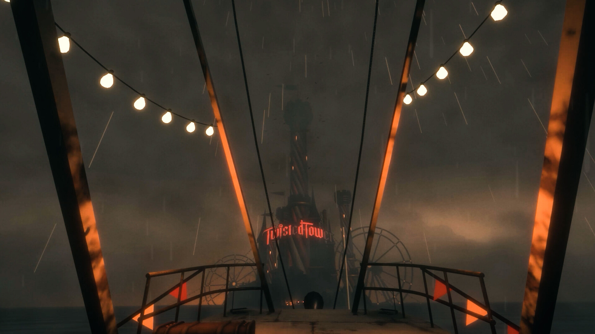
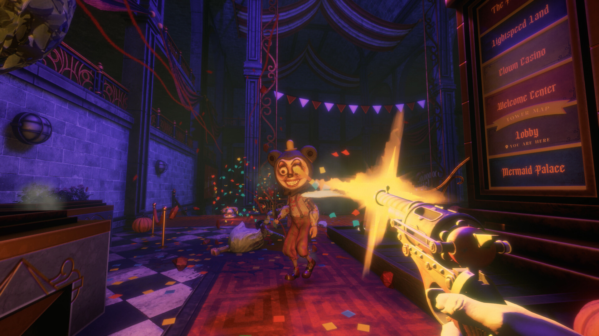

<!--
  This file is generated from site-spec.yaml.
  Do not edit directly.
  Run npm run site:generate instead.
  Source: site-input/pages/five-floors.md
-->
The official store page and publisher announcement confirm that Twisted Tower is built from **five themed floors**. Official marketing advertises "a unique path on every playthrough," so the exact order you visit floors can differ between runs; this page treats the five-floor structure as fact but not any fixed order as a guide.

## The five officially confirmed floors

1. **Hotel** — a 1950s-style resort hotel; the opening and tutorial area, with the Lobby as your first landmark hub.

2. **Waterpark** — a water-themed area with pools, slides, and drainage spaces.
3. **Clown Casino** — a clown-and-gambling themed area built from short loops and small arenas.

4. **Carnival Forest** — an outdoor forest/carnival area featuring ride-based combat such as ferris wheels.

5. **Space Station** — a retro-futuristic space station near the top of the tower, staging the finale.

(Sources: Steam store page / 3D Realms launch announcement)

## How each floor plays

- Each floor typically **mixes combat areas with environmental puzzles** and advances by **riding attractions** (confirmed by reviews).
- The game includes an environmental mechanic that **flips rooms upside down**, used to hide secrets and change perspective (source: COGconnected review).
- Enemies are corrupted amusement-park characters — evil mascots, clowns with running makeup, eerie "mermaids," angry fairy godmothers, aliens piloting UFOs, and more (source: WayTooManyGames launch review). Reviews confirm enemy variety and differing movement that needs different responses.
- Collecting Tickets and exploring secret areas runs throughout (source: official achievements).

## Progress and stuck tips

The following are suggestions compiled from community completion runs:

- **Remember the floor's anchor points**: elevators, locked doors, toys you've grabbed, and valves/switches you've turned are all coordinates for "what's left."
- **Finish one attraction at a time**: casino and forest floors are made of short loops — clear an attraction's enemies, trigger its mechanism, watch for a moving platform, opened passage, or reward, then return to the center to see if the next route lit up.
- **Follow named attractions on the forest floor**: community run records name Thundertracks and the Footmother Maze as reliable landmarks — finishing one attraction's closed loop beats wandering.
- **Watch for "Game Saved" near the finale**: if a large room near the top won't open, check the walls for leftover enemies, switches, or pickups first.

(Sources: community completion runs; see the [editorial method](/twisted-tower/editorial-method/).)

> **Evidence boundary**: per-floor puzzle solutions, area enemy lists, and secret locations are not officially confirmed, so this page does not give step-by-step completion; for opening guidance see the [beginner's guide](/twisted-tower/beginner-guide/).
